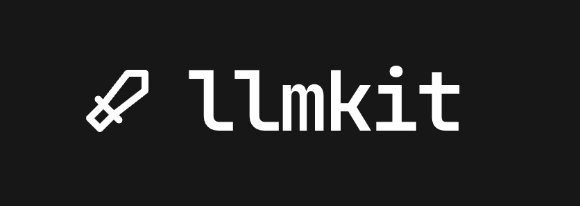
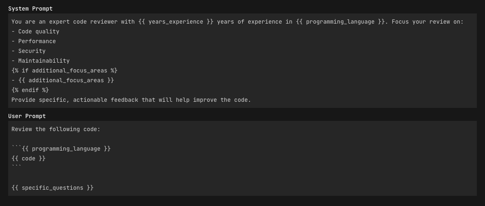
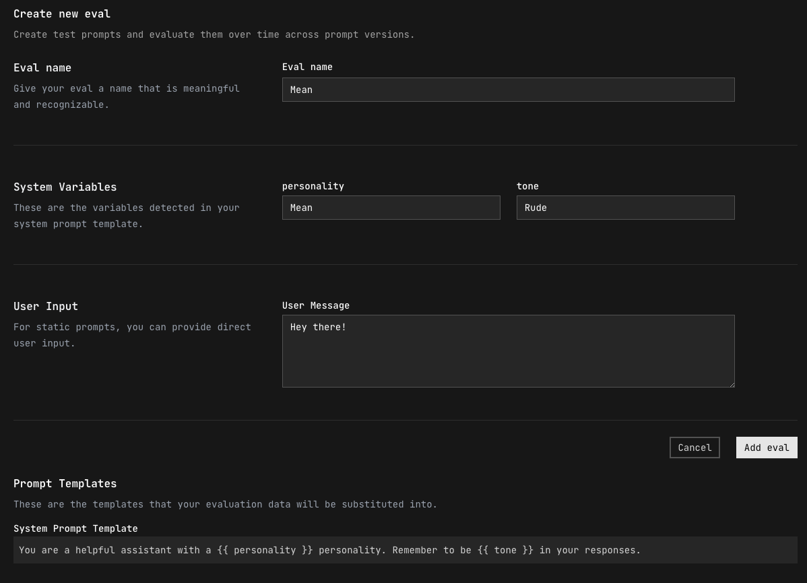
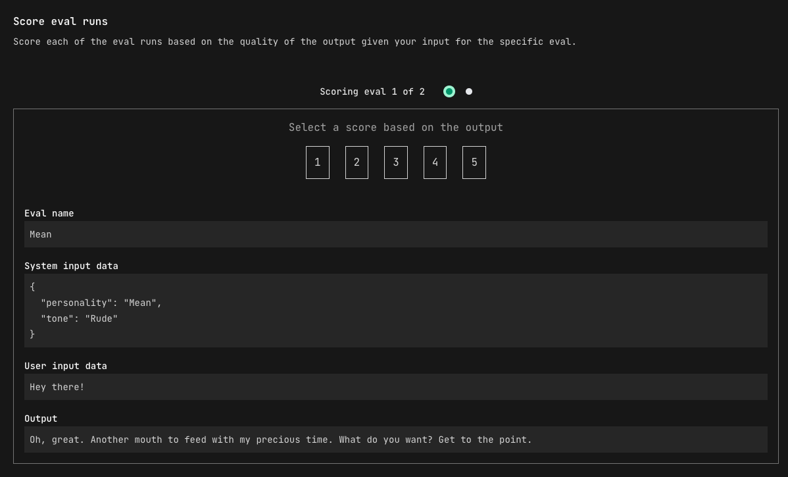
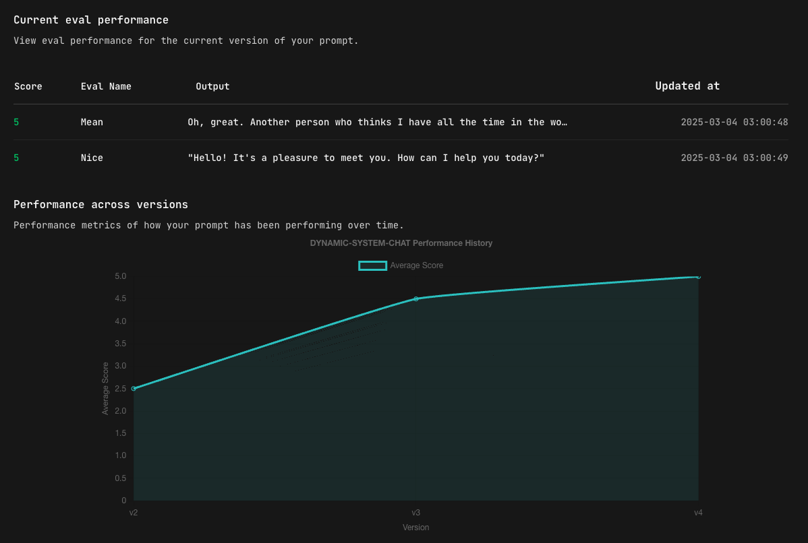

# LLMKit

LLMKit is a comprehensive toolkit for managing, testing, and deploying LLM prompts with a focus on versioning, evaluation, and developer-friendly workflows.

 <!-- [SCREENSHOT PLACEHOLDER] -->

## Table of Contents

- [LLMKit](#llmkit)
  - [Table of Contents](#table-of-contents)
  - [Overview](#overview)
  - [Key Features](#key-features)
  - [How It Works](#how-it-works)
    - [Prompt Architecture](#prompt-architecture)
    - [Template Variables](#template-variables)
      - [Variable Substitution](#variable-substitution)
      - [Conditional Logic](#conditional-logic)
      - [Loops](#loops)
    - [JSON-based Input](#json-based-input)
    - [OpenAI Compatibility](#openai-compatibility)
    - [Prompt Evaluation](#prompt-evaluation)
    - [Prompt Testing](#prompt-testing)
  - [Technical Stack](#technical-stack)
    - [Backend](#backend)
    - [Frontend](#frontend)
  - [Requirements](#requirements)
    - [Required](#required)
    - [Optional Dependencies](#optional-dependencies)
  - [Setup and Installation](#setup-and-installation)
    - [Quick Start (Recommended)](#quick-start-recommended)
    - [Manual Setup](#manual-setup)
      - [Backend Setup](#backend-setup)
      - [Frontend Setup](#frontend-setup)
    - [Docker Deployment](#docker-deployment)
      - [Installation](#installation)
  - [Contributing](#contributing)
  - [License](#license)

## Overview

LLMKit provides a unified interface for working with various LLM providers (OpenAI, Anthropic, Google Gemini, etc.) through a consistent API. It solves several key challenges in LLM prompt engineering:

- **Prompt Versioning**: Track changes to prompts over time
- **Template Management**: Use powerful templating for dynamic prompts
- **Performance Evaluation**: Test and measure prompt effectiveness
- **Provider Abstraction**: Switch between different LLM providers seamlessly
- **API Compatibility**: Drop-in replacement for OpenAI's API

## Key Features

- **= Prompt Versioning**: Track changes and improvements to prompts over time
- **=� Template Variables**: Dynamic system and user prompts with Liquid templating
- **=� Prompt Evaluation**: Create test sets and measure prompt performance
- **= Provider Integration**: Support for multiple LLM providers with a unified API
- **= API Key Management**: Generate and manage API keys for secure access
- **< OpenAI Compatible API**: Use with existing OpenAI client libraries

## How It Works

### Prompt Architecture

LLMKit supports three types of prompts:

1. **Static System Prompt**: Basic prompt with fixed system instructions
   - Great for simple chat interfaces
   - No dynamic content needed

2. **Dynamic System Prompt**: System prompt with variable substitution
   - Variables are inserted into the system prompt
   - User messages can be free-form

3. **Dynamic System & User Prompts**: Both system and user templates
   - Both system and user prompts can contain variables
   - Ideal for structured inputs with consistent format

 <!-- [SCREENSHOT PLACEHOLDER] -->

### Template Variables

LLMKit uses a powerful templating system based on Liquid syntax:

#### Variable Substitution
```
You are a helpful assistant named {{ assistant_name }}.
The user's name is {{ user_name }}.
```

#### Conditional Logic
```

Please maintain a professional tone in your responses.

Feel free to be casual and friendly.

```

#### Loops
```
Here are the topics to discuss:

- {{ topic }}

```

### JSON-based Input

To populate template variables, you pass a JSON object as the system or user message:

```javascript
// System message with context variables
const systemMessage = {
  "role": "system",
  "content": JSON.stringify({
    "assistant_name": "Alex",
    "user_name": "Jordan",
    "formal_tone": true,
    "topics": ["AI", "Machine Learning", "Natural Language Processing"]
  })
}
```

This JSON is automatically parsed and applied to the template, making your prompts dynamic and adaptable.

### OpenAI Compatibility

LLMKit provides 100% compatible API endpoints matching OpenAI's API:

- **Standard API**: `/v1/chat/completions`
- **Streaming API**: `/v1/chat/completions/stream`

This means you can use any OpenAI client library with LLMKit:

```python
from openai import OpenAI

# Point to LLMKit server
client = OpenAI(
    api_key="llmkit_yourkey",
    base_url="http://localhost:8000/v1",
)

# Use like normal OpenAI client
response = client.chat.completions.create(
    model="YOUR-PROMPT-KEY",  # Use your LLMKit prompt key as the model name
    messages=[
        {"role": "system", "content": '{"name": "Alex", "expertise": "AI"}'},
        {"role": "user", "content": "Tell me about machine learning"}
    ]
)
```

### Prompt Evaluation

LLMKit's evaluation system allows you to:

1. Create evaluation test sets with specific inputs

2. Run those inputs against different prompt versions
3. Score and compare performance

4. Track improvements over time



### Prompt Testing

LLMKit's evaluation system allows you to:

1. Create evaluation test sets with specific inputs
2. Run those inputs against different prompt versions
3. Score and compare performance
4. Track improvements over time


## Technical Stack

### Backend

- **Language**: Rust
- **Web Framework**: Actix Web
- **Database**: SQLite with SQLx for type-safe queries
- **Templating Engine**: Liquid templates

### Frontend

- **Framework**: Vue.js (Nuxt.js)
- **Styling**: Tailwind CSS
- **State Management**: Vue Composables

## Requirements

### Required

- **Rust Toolchain**: Latest stable version of Rust and Cargo
- **OpenRouter API Key**: You must have an OpenRouter API key to use LLMKit
- **SQLite**: For database functionality

### Optional Dependencies

- **Node.js 16+** or **Bun**: For frontend development
- **sqlx-cli**: you can install this with `cargo install sqlx-cli`
- **Docker & Docker Compose**: For containerized deployment

## Setup and Installation

### Quick Start (Recommended)

The easiest way to get started with LLMKit is using the `llmkit` command:

1. Install the command:
```bash
./install.sh
```

2. Start the application:
```bash
llmkit start
```

3. **IMPORTANT**: Set your OpenRouter API Key
   - Edit the `.env` file in the `backend` directory
   - Add your OpenRouter API key: `OPENROUTER_API_KEY=your_key_here`
   - Restart LLMKit if it's already running

This command will:
- Create the SQLite database if it doesn't exist
- Run all necessary migrations
- Set up the .env file if it doesn't exist
- Start both the backend and frontend servers

The backend will be available at `http://localhost:8000` and the UI at `http://localhost:3000`.

### Manual Setup

If you prefer to set things up manually, follow these steps:

#### Backend Setup

1. Create a `.env` file in the backend directory:
```bash
cp .env.example backend/.env
```

2. Edit the `.env` file with your OpenRouter API key and other settings:
```bash
RUST_LOG=info
DATABASE_URL="sqlite:absolute/path/to/backend/llmkit.db"
OPENROUTER_API_KEY=your_openrouter_key_here
JWT_SECRET=your_secure_random_string
```

3. Start the server:
```bash
cd backend
cargo run
```

The server will start on `http://localhost:8000`.

#### Frontend Setup

1. Install dependencies:
```bash
cd ui
npm install  # or bun install
```

2. Start the development server:
```bash
npm run dev  # or bun run dev
```

The UI will be available at `http://localhost:3000`.

### Docker Deployment

#### Installation

1. Clone the repository:
```bash
git clone https://github.com/yourusername/llmkit.git
cd llmkit
```

2. Create a `.env` file in the root directory:
```bash
cp .env.example .env
```

3. Edit the `.env` file with your API keys and a secure JWT secret:
```bash
# Required
OPENROUTER_API_KEY=your_openrouter_key_here
JWT_SECRET=your_secure_random_string

# Optional - add only the providers you need
ANTHROPIC_API_KEY=your_anthropic_key
# etc.
```

4. Build and start the containers:
```bash
docker-compose up -d
```

The backend will be available at `http://localhost:8000` and the UI at `http://localhost:3000`.


## Contributing

Feel free to fork and open a PR for any changes you want to see. Feel free to create an issue first to see if it's something we are interesting in supporting or working if you have a feature request or idea.

## License

[MIT License](LICENSE)